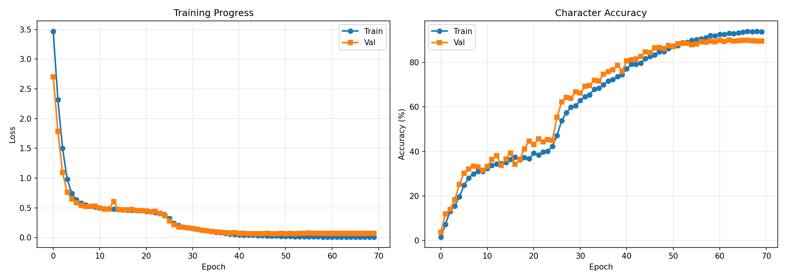

# OCR from Scratch

> **Optical Character Recognition built entirely from scratch** using a CNN + Transformer architecture, trained with CTC loss and Apple Silicon MPS acceleration.

---

## What this project does

The model reads an image of handwritten or printed text (64 × 1024 px) and outputs the predicted character sequence. It was built without any pre-trained backbone — the full pipeline from image preprocessing to character decoding is custom.

## Architecture

```
Input image [3 × 64 × 1024]
    │
    ▼
CNN Backbone (Conv → BN → ReLU × 5 blocks + AdaptiveAvgPool)
    │  extracts visual column features → [512 × 1 × W]
    ▼
Linear Projection  →  512 → 256
    │
    ▼
Positional Encoding
    │
    ▼
Transformer Encoder (4 layers, 8 heads, GELU activation)
    │
    ▼
Linear Head  →  256 → vocab_size
    │
    ▼
CTC Greedy Decoder  →  predicted text string
```

| Component  | Details |
|------------|---------|
| CNN        | 5 conv blocks, BatchNorm, AdaptiveAvgPool |
| Transformer| 4 layers, 8 heads, d_model=256 |
| Loss       | CTC (blank index = 0) |
| Optimizer  | AdamW + OneCycleLR scheduler |
| Hardware   | Apple M4 MPS (CPU fallback for CTC) |
| Image size | 64 × 1024 px |

---

## Repository structure

```
ocr-from-scratch/
├── 01_eda.ipynb            # Exploratory data analysis on the OCR dataset
├── 02_training_mps.ipynb   # Full training pipeline with MPS acceleration
├── results/
│   ├── best_mps_model.pth          # Best model checkpoint (generated after training)
│   ├── mps_training_results.png    # Loss & accuracy curves
│   ├── predictions.json            # Sample predictions from the validation set
│   └── converted_python_codes.json # LLaMA-converted algorithm predictions
└── api/                    # FastAPI deployment
    ├── main.py             # REST API with /predict & /predict/batch endpoints
    ├── model.py            # Model class + inference utilities
    ├── requirements.txt
    ├── Dockerfile
    ├── docker-compose.yml
    └── README.md
```

The training data lives in `../ocr_data/dataset/`.

---

## Quick start — Training

```bash
# 1. Explore the data
jupyter notebook 01_eda.ipynb

# 2. Train the model (saves best_mps_model.pth in results/)
jupyter notebook 02_training_mps.ipynb
```

---

## Quick start — API

See [api/README.md](api/README.md) for full instructions.

```bash
cd api
pip install -r requirements.txt
uvicorn main:app --reload --port 8000
# → http://localhost:8000/docs
```

---

## Results

| Metric | Value |
|--------|-------|
| Training epochs | 40 (early stopping, patience=12) |
| Optimizer | AdamW, lr=1e-4 → 3e-4 (OneCycleLR) |
| Batch size | 16 |
| Image resolution | 64 × 1024 |

Training curves: 
